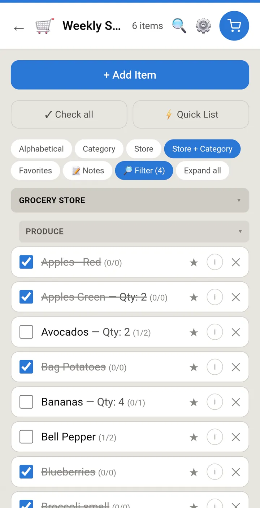
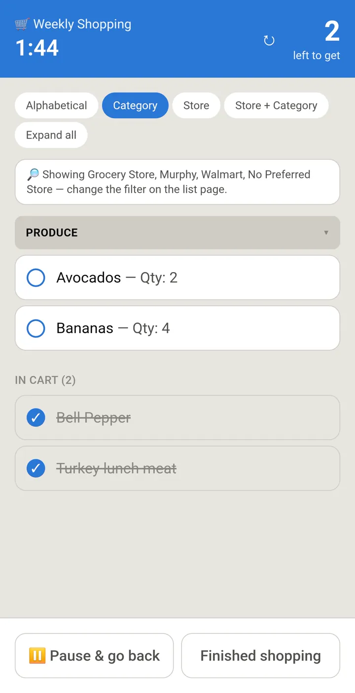
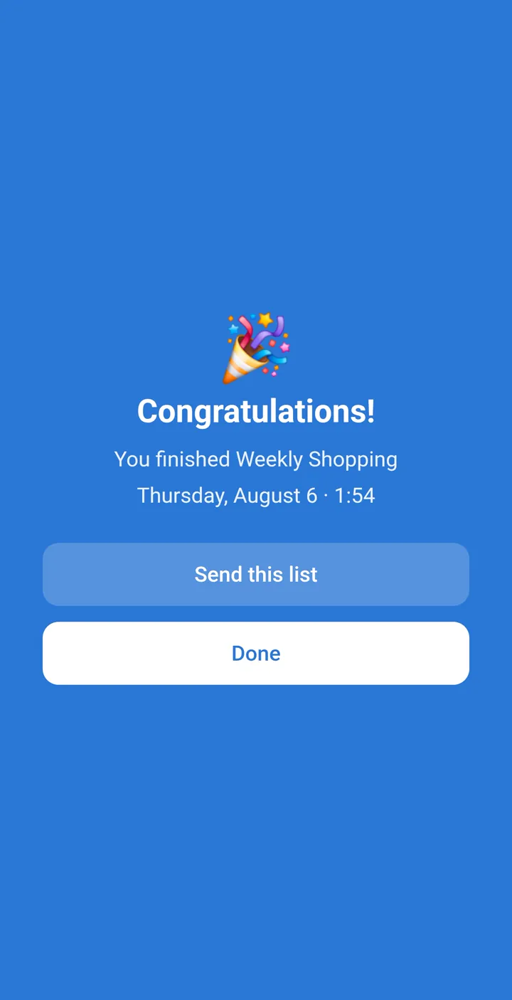

# BusyBeeGrocer

A shared shopping list for a household. One list, everyone can edit it, and it
keeps working when you're standing in a shop with no signal.

**Live app:** https://rexmarchant.github.io/busybeegrocer/

<p>
  
  
  
</p>

## What it does

- **Shared lists.** Invite people by email; everyone in a group sees the same lists in real time.
- **Organised the way you actually shop.** Items carry a category and a preferred store, and can be
  sorted and grouped by either — so the list reads in the order you walk the aisles.
- **Shopping mode.** A stripped-back screen for the trip itself: a timer, a count of what's left,
  and checked items moved out of the way. The store filter you set on the list carries into it.
- **Works offline.** The list is cached on your phone, and items you tick off with no signal are
  saved and sent when you're back online. Both states are shown, never guessed at.
- **Trip history.** Past trips are kept, so a list can be rebuilt from the last shop in one tap.

## Stack

React 19 + TypeScript, Vite, Tailwind CSS v4, and a `vite-plugin-pwa` service worker.
Supabase provides Postgres, auth and edge functions; Resend sends the sign-in emails.
Cloudflare Turnstile guards sign-in, and Sentry collects errors.

Auth is passwordless — a magic link, with a one-time code as a fallback for when the link opens
in a different browser than the installed app.

## Running it locally

```bash
cd app
npm install
cp .env.example .env.local   # then fill in the Supabase values
npm run dev
```

`.env.local` needs `VITE_SUPABASE_URL` and `VITE_SUPABASE_ANON_KEY` from your Supabase project.
`VITE_SENTRY_DSN` is optional and best left blank locally: with no DSN the Sentry SDK is
tree-shaken out entirely, so local crashes never reach the real project.

| Command | What it does |
| --- | --- |
| `npm run dev` | Vite dev server on http://localhost:5173 |
| `npm run build` | Typecheck (`tsc -b`) then production build |
| `npm test` | Unit tests via Node's built-in runner |
| `npm run lint` | oxlint |

## Database

Migrations live in `../supabase/migrations`, named with the timestamp version the database
records. They are applied against the hosted project rather than through a local Supabase stack —
if you adopt the CLI, `supabase link` first and check the recorded history matches these filenames
before running `db push`.

The schema is group-scoped throughout: every table is reachable only via `group_members`
membership in its RLS policies, and lists add a further private/owner-only gate. Joining a group
is possible **only** through `create_group()` or `accept_invite()`.

## Deployment

Pushing to `main` runs `.github/workflows/deploy.yml`, which lets semantic-release bump the
version from Conventional Commits, builds, and publishes to GitHub Pages. The release commit
carries `[skip ci]` so it doesn't retrigger the workflow.

Commit messages therefore matter: `fix:` cuts a patch, `feat:` a minor, and a commit that follows
no convention produces no release at all.

## Privacy

What the app stores and who it's shared with is described in [PRIVACY.md](../PRIVACY.md), and is
also reachable in-app at `/privacy`.

## License

See [LICENSE](../LICENSE).
